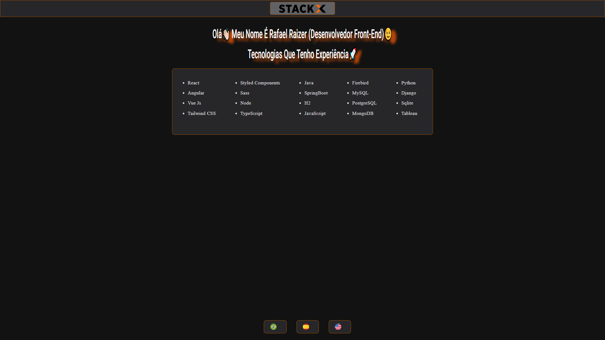

# Olá  

***
#  Venho aqui apresentar 
# DESAFIO WEB 3.0 STACKX
## Lançados 03 projetos que fazem parte do Módulo Web 3.0 do Curso StackX - Formação de Desenvolvedores de Software. 
##  Requisitos para o Desafio:

1) A lista de tecnologias deve ser um array onde no HTML você irá fazer um map para listar;


2) Ao clicar no botão de linguagem o texto de apresentação ”Olá meu nome....” muda para a linguagem selecionada;


3) O botão de linguagem deve ser um componente onde você passará 3 propriedades: Título, ícone e o click dele;


4) Para estilização 
- React use Styled Components
- Angular use Sass 
- Vue use Tailwind CSS

***
# Suas aplicações vão ser:

  

***
#  Ferramenta Do Desafio⁉


***
##  &nbsp;Linguagem Tecnológica do Desafio:


***
# 2º Desafio  ANGULAR

<br>

Este projeto foi gerado com o Angular CLI versão 15.0.3 e o sistema SASS que é uma linguagem de extensão do CSS, tornando o processo de desenvolvimento mais simples e eficiente.

<br>

  ### <div align="center">[Clique aqui para acessar o Projeto](https://rafarz76dev-02-desafiostackx-web-3-0-angular.vercel.app/)

***
   
   
 ***
 # Passo a Passo do Projeto:
   
   ## Instalando no ```terminal power shell``` clicando no botão direito como administrador para o projeto em angular 
  
### 1º Executar o comando CLI usando o npm gerenciador de pacotes e clica com botão direito em administrador, ao abrir digita:
- ```npm install -g @angular/cli  ```

### 2º Para criar, construir e servir um novo projeto Angular básico em um servidor de desenvolvimento, vá para o diretório (pasta) que criou no seu espaço de trabalho e use o seguinte comando👇
- ```ng new nome do projeto ( ex. projetoangular-web3.0)  ```

###  Quando perguntar digita:  - ```y ```

### Escolhe a estilização `` `Sass``` e dá ```Enter```

### Aguarda a instalação dos pacotes no projeto,

### E altera copiando e colando para a pasta do projeto que foi criado antes de abrir no VSCode com o comando.
```cd nomepastaprojeto```

### 3º Agora sim vai Abrir o Projeto no Terminal para a ferramenta VSCode, digitando 👊
```code .```

   ## Dentro do editor de código VSCode:

### Executar o projeto no servidor digitando:
```ng serve```
###  Vai compilar na porta `http://localhost:4200/`. 

### Criando component:
- ```ng g c```

 O componente é composto por 3 arquivos, para template (HTML), estilo (SASS) e classe (TS) e toda essa configuração é feita dentro do decorador @Component onde é passado como metadados o template, o estilo e um seletor para que este componente possa ser usado em outro template.

### Criando module:
- ```ng g m```

 É uma classe marcada pelo decorador. recebe um objeto de metadados que descreve como compilar o modelo de um componente e como criar um injetor em tempo de execução.

### Bibliotecas importadas no terminal do VSCode👇  
- ```ng add @angular/material```

 Inclui informações sobre pré-requisitos, instalação do Angular Material e, opcionalmente, exibição de um componente Material de amostra em seu aplicativo para verificar sua configuração.
  
### Implementando Build
- ```ng build```

 Execute 'ng build' para compilar o projeto. Os artefatos de compilação serão armazenados no diretório 'dist/'.
  
  ### Criando o módulo de rotas
  
  Em nossa aplicação é um arquivo de módulo das rotas e importá-lo posteriormente no Root Module. Este arquivo de rotas, normalmente chamado app-routing.module.ts

***
### ▶ 😀👀 Bora lá....

### Gostou, então já clica na 🌟
